# Fuzzy PD Controller

## Project Overview

This project implements a Fuzzy Logic-based Proportional-Derivative (PD) Controller using MATLAB/Simulink environment. The controller employs Mamdani inference system with 49 fuzzy rules to provide intelligent control behavior for dynamic systems.

## System Architecture

### Fuzzy Inference System Specifications

- **Type**: Mamdani fuzzy inference system
- **Inputs**: 2 (Error and Error Derivative)
- **Outputs**: 1 (Control Signal)
- **Number of Rules**: 49
- **Defuzzification Method**: Centroid

### Input Variables

1. **Error (e)**
   - Range: [-1, 1]
   - Membership Functions: 7 triangular functions
   - Linguistic Terms: NB, NM, NS, ZE, PS, PM, PB

2. **Error Derivative (de/dt)**
   - Range: [-1, 1]
   - Membership Functions: 7 triangular functions
   - Linguistic Terms: NB, NM, NS, ZE, PS, PM, PB

### Output Variable

**Control Signal (u)**
- Range: [-1, 1]
- Membership Functions: 7 triangular functions
- Linguistic Terms: NB, NM, NS, ZE, PS, PM, PB

## Implementation Details

### Membership Functions

All input and output variables use triangular membership functions with the following linguistic terms:

- **NB**: Negative Big
- **NM**: Negative Medium  
- **NS**: Negative Small
- **ZE**: Zero
- **PS**: Positive Small
- **PM**: Positive Medium
- **PB**: Positive Big

### Linguistic Variables Table

  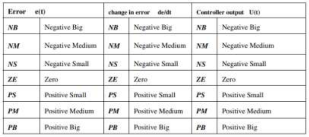

### Fuzzy Rule Base

The system implements a complete 7×7 rule matrix (49 rules total) that maps combinations of error and error derivative to appropriate control actions. The rule structure follows PD controller logic where:

- Large errors require strong corrective actions
- Error derivatives provide predictive behavior
- Combined evaluation ensures system stability

### Fuzzy Rules Table

  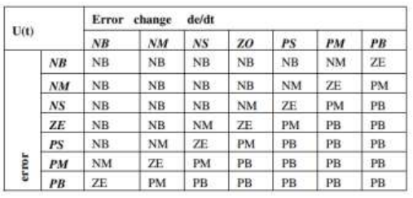

### MATLAB Configuration

#### Input/Output Settings

  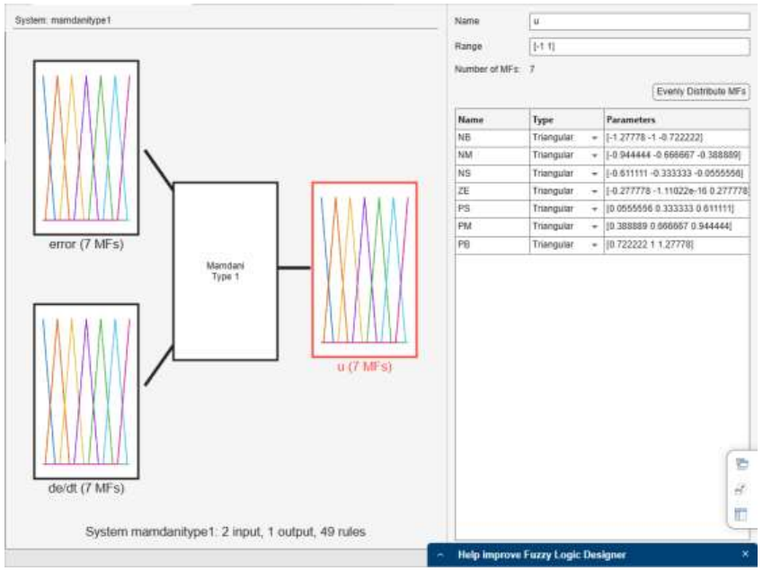

#### Fuzzy Rules Configuration

  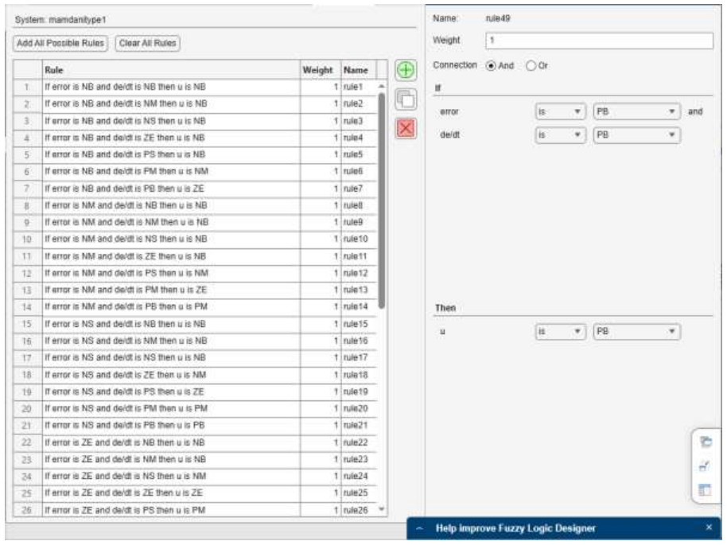

### Inference Methods

- **AND Operation**: Minimum (min)
- **OR Operation**: Maximum (max)
- **Implication**: Minimum (min)
- **Aggregation**: Maximum (max)
- **Defuzzification**: Centroid method

## System Performance

The fuzzy PD controller provides several advantages over conventional PD controllers:

- **Nonlinear Control Action**: Better handling of system nonlinearities
- **Robustness**: Reduced sensitivity to parameter variations
- **Smooth Control**: Continuous output without abrupt changes
- **Expert Knowledge Integration**: Rule-based approach incorporates human expertise

## Implementation Notes

### Design Considerations

1. **Rule Coverage**: Complete rule matrix ensures all input combinations are covered
2. **Membership Overlap**: Triangular functions with appropriate overlap prevent rule gaps
3. **Symmetric Design**: Balanced positive/negative response characteristics
4. **Centroid Defuzzification**: Provides smooth, continuous output

### Performance Tuning

- Adjust membership function parameters for specific applications
- Modify rule consequences for different control strategies
- Scale input/output ranges based on system requirements

## Results and Analysis

### Solution Schemes

#### Part 1 Solution Scheme

  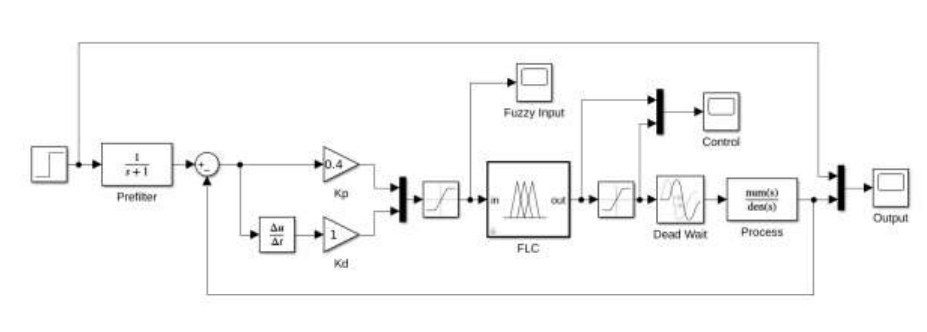

#### Part 2 Solution Scheme

  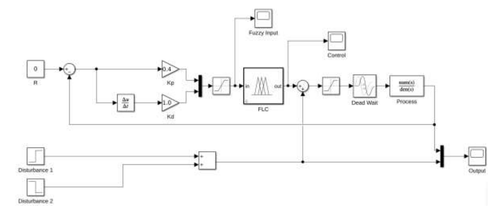

### Signal Results

#### Part 1 Results

  <table>
    <tr>
      <td align="center">
        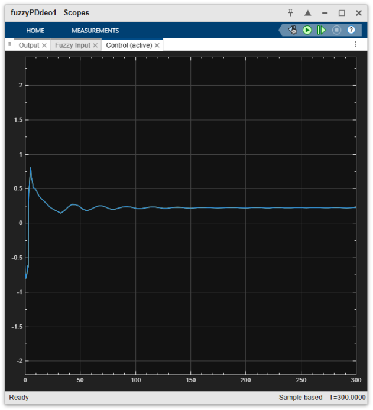
         <b>Control Signal</b>
      </td>
      <td align="center">
        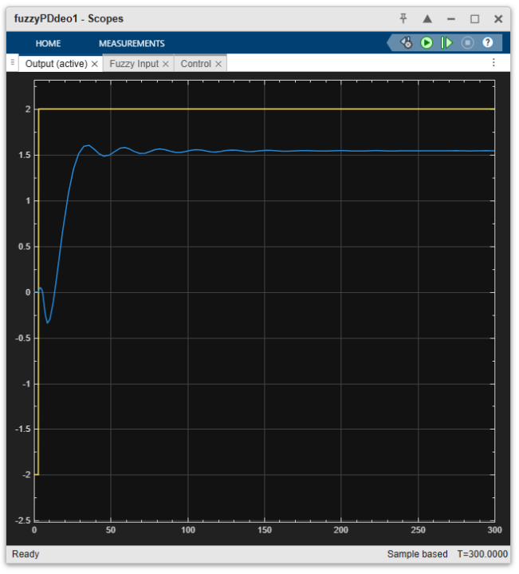
         <b>Output Signal</b>
      </td>
      <td align="center">
        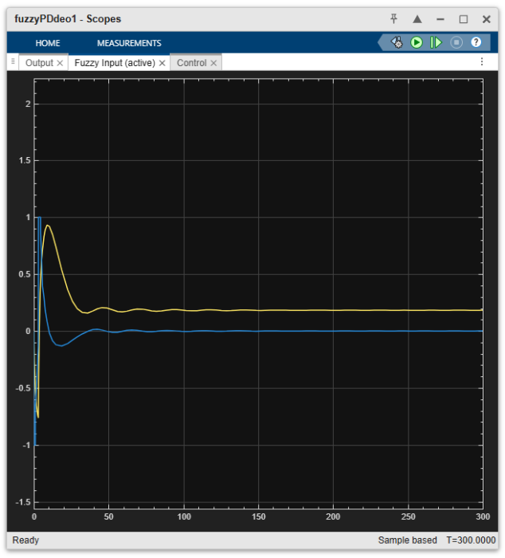
         <b>Fuzzy Input</b>
      </td>
    </tr>
  </table>

#### Part 2 Results

  <table>
    <tr>
      <td align="center">
        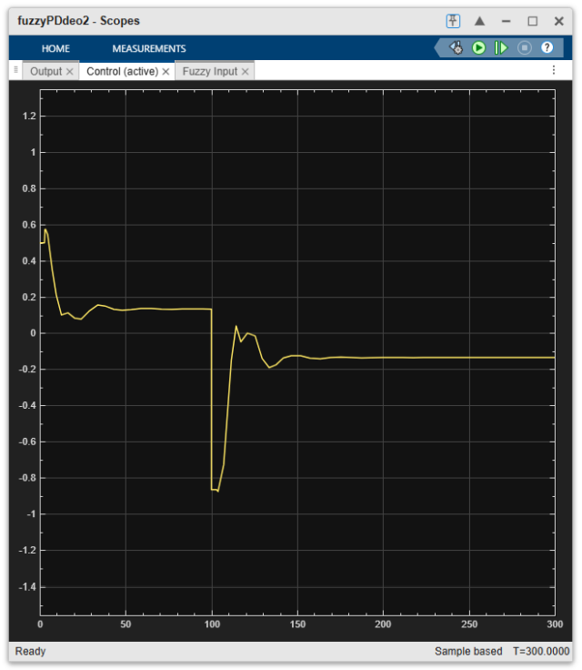
         <b>Control Signal</b>
      </td>
      <td align="center">
        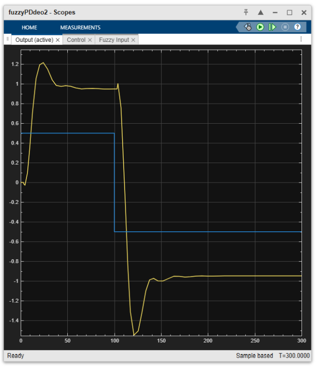
         <b>Output Signal</b>
      </td>
      <td align="center">
        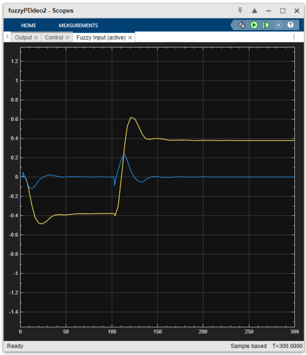
         <b>Fuzzy Input</b>
      </td>
    </tr>
  </table>

